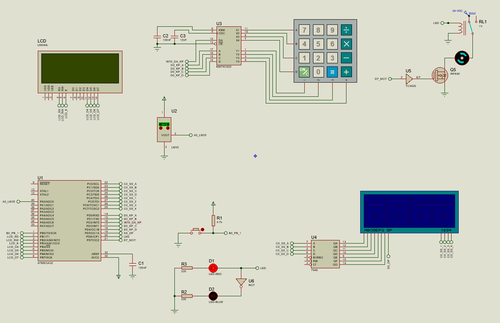

# AVR Temperature-Based Motor Control System
A university project developed using the ATmega32 microcontroller. This project measures temperature using an LM35 sensor and adjusts the speed of a DC motor accordingly using PWM. It also includes a password-protected menu system, an LCD interface, and a 4-digit 7-segment display.

## Features
- 🔐 Login system via keypad (74C922)
- 🌡️ Temperature reading via LM35 sensor
- ⚙️ PWM-based DC motor speed control
- 📟 20x4 LCD user interface
- ⏰ Internal real-time clock using Timer
- 🔢 4-digit 7-segment display driven by 7448
- 🧮 Adjustable threshold and motor speed
- 🛠️ Written in C using CodeWizardAVR + CodeVisionAVR
- ✅ Fully simulated in Proteus

## History & Logging Capabilities
The system includes a comprehensive history logging feature that tracks:
- `Login Attempts` Records successful logins and failed attempts with timestamps
- `Threshold Changes` Logs previous and new temperature threshold values with time
- `Motor Speed Changes` Records motor speed adjustments with timestamps
- `Clock Changes` Tracks system time modifications
- `Accessible via Menu` View history by pressing 'x' or '/' in the main menu

## Hardware
- Microcontroller: ATmega32 (2 MHz)
- LCD 20x4 (connected to PORTB)
- Keypad via 74C922 (connected to PORTD)
- Temperature Sensor: LM35 (connected to ADC0)
- 4-digit Common Cathode 7-Segment (via 7448 and PORTC)
- DC Motor with PWM via Timer2
- Pushbuttons for interaction

## How It Works
1. On boot, the project displays student info.
2. Shows real-time temperature and system clock.
3. On pressing 'C' key, a login screen appears.
4. If credentials are correct:
   - User can access the menu to set:
     - Temperature threshold
     - Motor speed
     - Clock settings
5. Motor speed increases every 15s if the temperature exceeds the threshold.
   
## Files

- `main.c`: Complete source code generated using CodeVisionAVR & customized manually.
- `image.png`: Proteus schematic of the system.
- `README.md`: Project documentation for GitHub.

## Simulation
Below is the Proteus simulation schematic of the system:

- The ATmega32 is configured with a 2 MHz clock.
- LCD (20x4) is connected in 4-bit mode via PORTB.
- LM35 is connected to ADC0 with 2.56V internal reference.
- Keypad (via 74C922) is interfaced through PORTD.
- 7-segment display (MPX4-CC-BL) with 7448 decoder on PORTC.
- PWM output via Timer2 drives the motor through a transistor.

## Authors
- Mostafa Charkazi – [401249015]
- Meysam Sadeghi – [401249036]
- Ali Asghar Bararjanpour – [401249008]

📌 *Feel free to fork or modify the project for your own embedded system applications.*

